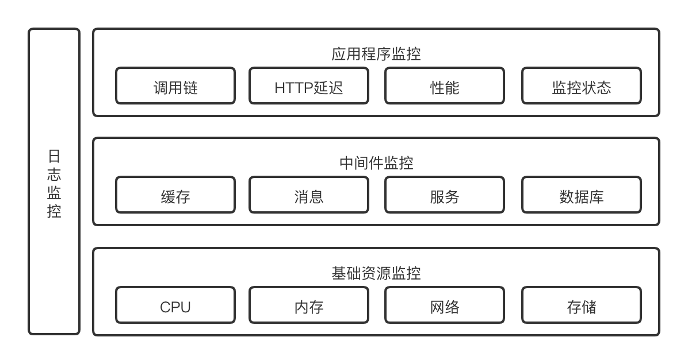

# 深入浅出 Prometheus 原理、应用源码与拓展详解

## 第1章 监控



对监控指标不要一味求全, 没有必要采集所有监控指标

# 第2章 深入Prometheus 设计 

## 2.1 指标

定义指标需要充分考虑通用性和拓展性

### 2.1.1 Prometheus 的指标定义

Prometheus的所有监控指标(Metric) 被统一定义为 

```
<metric name>{<label name>=<lable value>, ...}
```

指标定义涉及指标名称和标签两部分 

指标名称 类似 http_request_total

标签(labe) 类似于{status="200", method="POST"}

### 2.1.2 Prometheus的指标分类 

指标分为 Counter(计数器) Gauage(仪表盘) Histogram(直方图) 和 Summary(摘要)

> Counter

最大的特点是只增不减 

例如HTTP请求总量阿

一般我们可以用rate()方法获取该指标在某个时间段的变化率

> Gauge

Gauge是仪表盘 表征指标的实时变化情况 可增可减

例如CPU的内存的使用量 网络IO大小等等

> Summary

Summary和Histogram一样 属于高级指标

用于凸显数据的分布情况 

如果想了解某段时间的请求响应时间 通常用平均响应时间

平均响应时间很难甄别长尾效应

例如如果请求一般都收30ms 极个别的时候要几百ms 

```
vip_front_ft_0_duration{pageid=~"$pageid", quantile="0.5"}
```

例如这个获得到的数据就是 Ams 表示 百分50的用户 比A快

> Histogram

表示某个区间内的样本个数

xxxx{le="1.6384e+06"} 280

就表示 小于 1.6384e+06 个chunk的序列有280个

(但笔者随便找了个指标 来尝试 表示no data 待研究)

